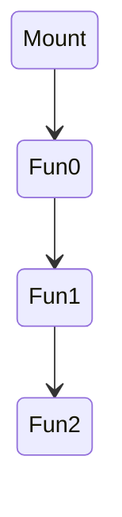
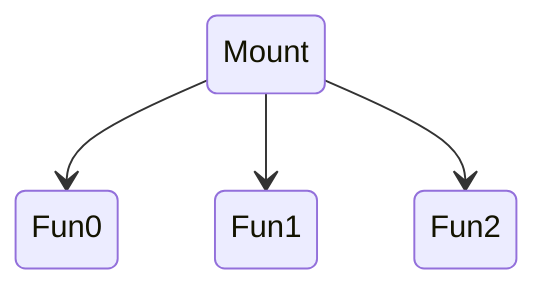

# Mario

Make Kubeflow pipelines intuitive

```bash
mario
├── __init__.py
├── node
│   ├── __init__.py
│   ├── base.py
│   ├── compute.py
│   ├── config.py
│   └── volume.py
├── script.py
└── volume.py
```

## Install

`pip install -e .`

## Usage

The most important class `mario.node.Node` has following subclasses

* `mario.node.Compute`: perform computation using a container image
* `mario.node.VolumeLoad`: load an existing volume
* `mario.node.VolumeClaim`: claim a new volume
* `mario.node.PullSecrets`: add pull secret to the pipeline

### Define pipeline nodes

```python
import mario

# computer nodes
fun0 = mario.node.Compute('fun0', 
                          'image:tag', 
                          command=['python3', 
                                   '/helloworld/main.py'], 
                          arg_names=['arg1', 'arg2'])

fun1 = mario.node.Compute('fun1', 
                          'image:tag', 
                          command=['sh', '-c', 'ls /mnt/data/'])

fun2 = mario.node.Compute('fun2', 
                          'image:tag', 
                          command=['sh', '-c', 'ls /mnt/data/'])

# load existing volume
vol0 = mario.node.VolumeLoad('existing_vol')

# claim new volume
vol1 = mario.node.VolumeClaim('claimed', '1Gi')

# pipeline pull secret
secret = mario.node.PullSecrets('your-pull-secret')
```

## Define pipeline topology

The pipeline is wrapped in a `Callable` with typed input args. The `Callable` name will become pipeline name and the doc string will become the pipeline description.

* Use `(arg1, arg2,...)` to pass args to container entry-point.
* Use `[/mount-point]` to indicate mount point in the container
* The mount points indicate the compute node topology

### Sequential

```python
def sequential_mount(a: int, b: str):
    """Doc string will become the pipeline description"""
    secret()
    vol = vol0()
    optional_container_handle = fun0['/mnt/data/'] = vol
    # set additional attributes using optional_container_handle
    fun0(arg1 = a, arg2 = b)
    fun1['/mnt/data/'] = fun0['/mnt/data/']
    fun1()
    fun2['/mnt/data/'] = fun1['/mnt/data/']
    fun2()
```

```python
def sequential_claim(a: int, b: str):
    secret()
    vol = vol1()
    fun0['/mnt/data/'] = vol
    fun0(arg1 = a, arg2 = b)
    fun1['/mnt/data/'] = fun0['/mnt/data/']
    fun1()
    fun2['/mnt/data/'] = fun1['/mnt/data/']
    fun2()
```


### Parallel

```python
def distributed_network():
    secret()
    v = vol1()
    fun0['/data/'] = v
    fun0()
    fun1['/data/'] = v
    fun1()
    fun2['/data/'] = v
    fun2()
```



## Script

`mario.script.save(function: Callable, filename: Optional[str]=None, **kwargs) -> None`

```python
mario.script.save(sequential_mount, 'optional_name.yaml')
```

## Kubeflow vs Mario

### With Kubeflow

```python
import kfp
import kfp.dsl as dsl
import kubernetes as k8s
```

#### Components

Components are saved as Yaml files:

```yaml
name: hello world
description: import numpy and print out two args

inputs:
- name: arg1
  type: Integer
  description: arg 1 type int
- name: arg2
  type: String
  description: arg 2 type string

implementation:
  container:
    image: image:tag
    command: [python3, /helloworld/main.py]
    args: [
      --arg1, {inputValue: arg1},
      --arg2, {inputValue: arg2}
    ]
```

Then load it to get factory function and call the function to get a component

```python
comp_op = kfp.components.load_component_from_file('comp.yaml')
op = comp_op(arg1, arg2)
```

#### Mount volume

```python
pvc = k8s.client.V1PersistentVolumeClaimVolumeSource(claim_name='some-name', read_only=False)
op.add_volume(k8s.client.V1Volume(name='human-name', persistent_volume_claim=pvc))
op.add_volume_mount(k8s.client.V1VolumeMount(mount_path='/mnt/data/', name='human-name'))
```

#### Pipeline

```python
@dsl.pipeline('pipeline name', 'descriptions')
def hello_world_pipeline(arg1: int, arg2: str):
    op = comp_op(arg1, arg2)
    op.add_volume(k8s.client.V1Volume(name='human-name', persistent_volume_claim=pvc))
    op.add_volume_mount(k8s.client.V1VolumeMount(mount_path='/mnt/data/', name='human-name'))
    dsl.get_pipeline_conf().set_image_pull_secrets(
        [k8s.client.V1LocalObjectReference(name="your-pull-secret")])
```

#### Save to file

```python
kfp.compiler.Compiler().compile(hello_world_pipeline, 'test-hello-world-pvc.yaml')
```

### With Mario

```python
import mario

vol = mario.node.VolumeLoad('some-name')
f = mario.node.Compute('hello world', 
                       'image:tag',
                       command=['python3', '/helloworld/main.py'], 
                       arg_names=['arg1', 'arg2'])
sec = mario.node.PullSecrets('your-pull-secret')

def hello_world_pipeline(arg1: int, arg2: str):
  """optional description"""
    sec()
    v = vol()
    f['/mnt/data/'] = v
    f(arg1, arg2)

mario.script.save(hello_world_pipeline)
```


